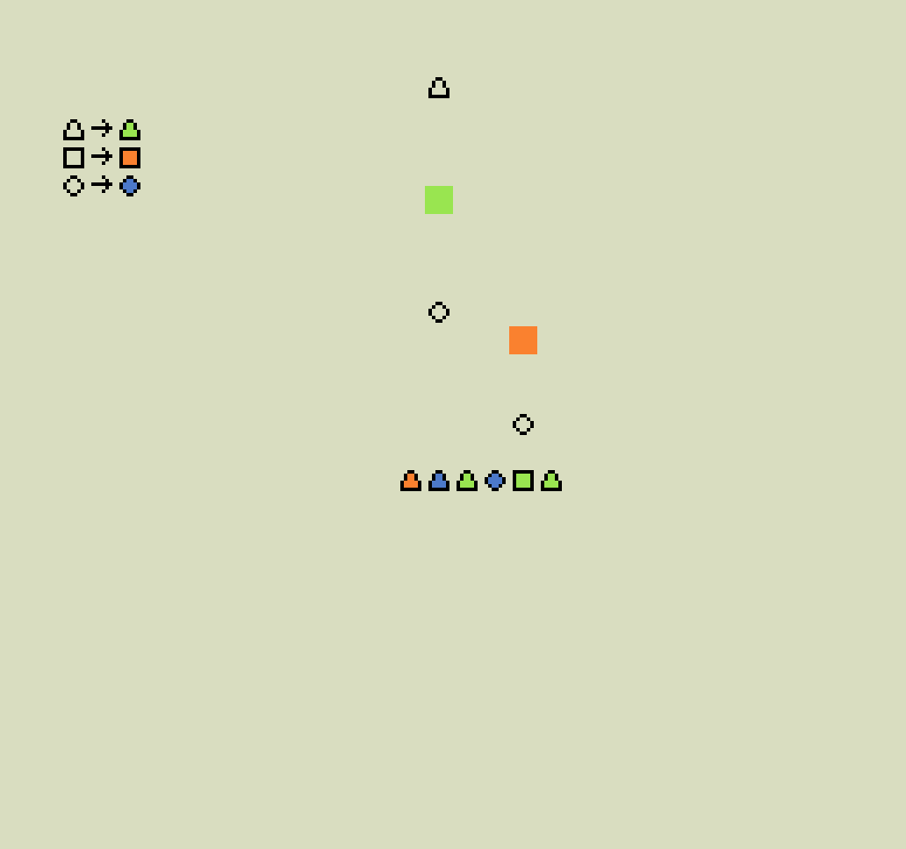

# Color That Shape

This is an assignment project for CMU 15466/15666 course.

#### Author: Jialan Dong

#### Design:

The goal is to color all triangles green, squares orange and circles blue. However, you can only rotate the queue with keyboard "A"/"D" or "Left"/"Right", trying to catch the right item falling from above. 

#### Screen Shot:

#### How Your Asset Pipeline Works:

I wrote an `asset_loader.cpp` for this. 

- It read the `.png` files listed in asset_list.txt in `\assets` and load them one by one.
  - For each file, analyze it's width and height, decide how many tiles are needed for this picture.
    - For each tile, read through every pixel and record the palette for this tile.
    - Edit the bit0 and bit1 for the tile so the bitmaps represent the color in corresponding palette.
- After processing all files, save the tiles and palettes in `\assets` folder.

#### How To Play:

The goal is to color all triangles green, squares orange and circles blue.

You can use keyboard `A / D` or `Left / Right` to rotate the shape queue.

Catching an item falling from above will change the corresponding shape/color into the item's shape/color.

#### How To Build:

Please read [NEST.md](NEST.md)

This game was built with [NEST](NEST.md).

